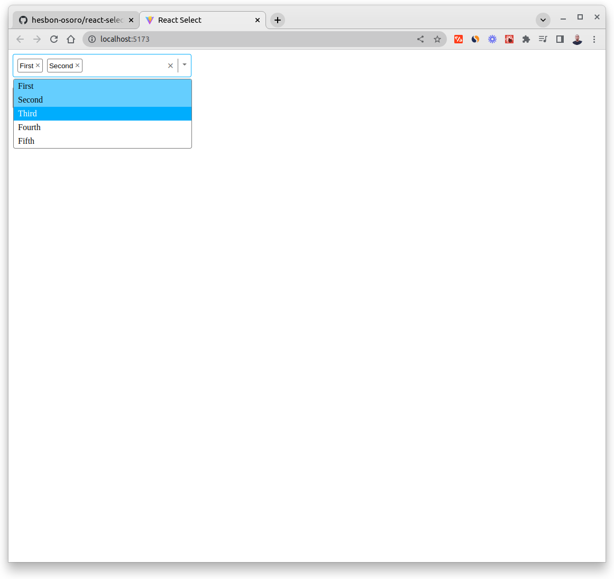
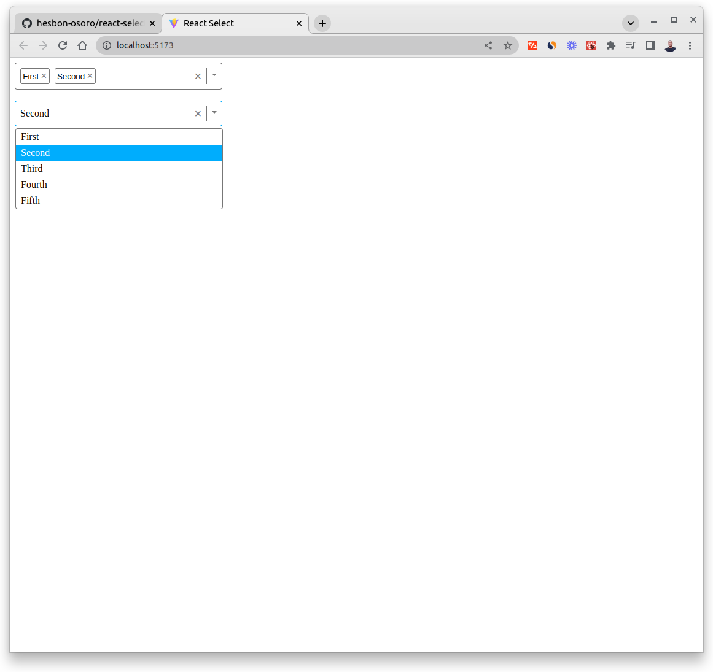

# React Custom Select

[](https://react-custom-select.netlify.app/)

[](https://react-custom-select.netlify.app/)

This is a custom Select component in React and TypeScript

## Technologies

- React
- TypeScript
- Vite
- CSS

## Setup

```code
# Clone this repo
git clone https://github.com/hesbon-osoro/react-select.git

# Navigate to directory and install packages
cd react-select && yarn

# Start the app
yarn dev
```

## Hooks

- useState
- useEffect
- useRef

## Events

- Keyboard
- Mouse

Give this project a Star!
